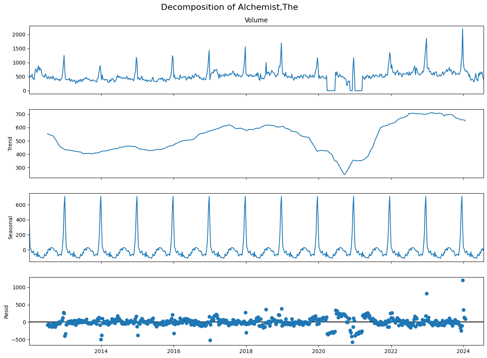
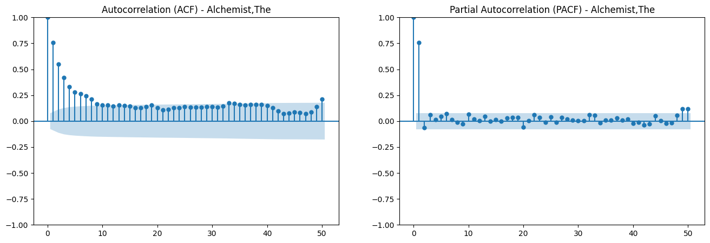

# Using Time Series Multi-Model Network for Next-Generation Sales & Demand Forecasting

## Optimizing Retail Supply Chains with Advanced Analytics

> **Confidentiality Notice:** This project was conducted under a strict Non-Disclosure Agreement (NDA). All client identification, specific product titles, and raw performance metrics have been masked or generalized (e.g., using "Product A" instead of specific names, and normalizing data scales). This portfolio project focuses on showcasing the *analytical methodologies, complex modeling roadmaps, and strategic business insights* generated for the client.

---

### Project Overview & Executive Teaser

This project solved a critical forecasting challenge for a **Global Media Measurement Firm**. The goal was to empower their specialist publisher partners—who often operate with lean inventory—with data-driven foresight. We transformed volatile, sparse weekly transactional data into actionable 8-month demand forecasts.

By developing a novel multi-stage analytical roadmap, transitioning from classical statistical models to complex deep learning hybrids, we delivered high-precision forecasting capability.

#### Key Project Visual Summary (The 'Wow' Factor)

This poster summarizes the entire project lifecycle, from raw data complexity to the final hybrid model performance and business impact.

| Project Infographic Teaser |
| --- |
| **[]** |
| *Figure 1: High-level overview of the demand forecasting methodology and key comparative results.* |

---

## Table of Contents

1. [The Business Challenge](https://www.google.com/search?q=%23the-business-challenge)
2. [The Data: From Noise to Signals](https://www.google.com/search?q=%23the-data-from-noise-to-signals)
3. [Analytical Roadmap: Step-by-Step Modeling](https://www.google.com/search?q=%23analytical-roadmap-step-by-step-modeling)
4. [Visual Analysis & Performance Comparison](https://www.google.com/search?q=%23visual-analysis--performance-comparison)
5. [Client Insights & Business Impact](https://www.google.com/search?q=%23client-insights--business-impact)
6. [Tools & Technologies](https://www.google.com/search?q=%23tools--technologies)

---

## The Business Challenge

Our client required a robust forecasting service for its independent publisher partners. These publishers needed to optimize investment, manage warehouse costs, and make critical data-driven reprint decisions. The objective was to predict the demand profile and economic lifespan of specific titles, forecasting 32 weeks (weekly granularity) and 8 months (monthly granularity) into the future. The primary metrics for success were reducing forecast error (MAE/MAPE).

---

## The Data: From Noise to Signals

The raw data consisted of transactional sales records for numerous book titles. The primary challenge was **sparsity**: sales are only recorded when they occur, leaving large gaps. To build robust models, significant preprocessing was required:

1. **Normalization & Merging:** Consolidating disparate data sheets and standardized identifiers (masked ISBNs).
2. **Regularization:** Resampling the time series to a strict weekly and monthly frequency, explicitly filling missing sales periods with zero to reflect true demand volatility.
3. **Stationarity Testing:** Implemented Augmented Dickey-Fuller (ADF) tests to confirm the stationarity of the processed series, a requirement for classical statistical modeling.

---

## Analytical Roadmap: Step-by-Step Modeling

We didn't just apply one model; we built a sophisticated ladder of complexity to find the optimal solution.

### Step 1: Statistical Benchmarking (SARIMA)

We established a robust baseline using Seasonal AutoRegressive Integrated Moving Average (SARIMA) models. This allowed us to explicitly decompose the series and understand fundamental components like trend and annual seasonality ($m=52$ for weekly).

### Step 2: Machine Learning Regression (XGBoost)

We transitioned to a supervised learning approach using XGBoost. This required significant feature engineering, specifically developing optimized lag features (ranging from 4-week to 52-week windows depending on the product stability) through cross-validated grid searching.

### Step 3: Deep Learning (LSTM Networks)

We built a complex Long Short-Term Memory (LSTM) recurrent neural network. This deep learning approach was designed to capture intricate, non-linear dependencies in the data that statistical models miss. We used MinMaxScaler for data preparation and KerasTuner to automate hyperparameter optimization (units, dropout, learning rate).

### Step 4: Final Innovation: The Hybrid Solution

Our final capability breakthrough came from realizing that statistical models excel at linear trends, while deep learning excels at non-linear residuals. We implemented two hybrid architectures:

* **Sequential Hybrid:** SARIMA models the main linear trend $\rightarrow$ LSTM is trained *only* on the remaining residuals.
* **Parallel Hybrid (Winner):** Standalone SARIMA and LSTM forecasts are generated simultaneously and combined using a **weighted average** optimized via grid search.

---

## Visual Analysis & Performance Comparison

*This section showcases the data science process. The visualizations below highlight the specific capabilities implemented.*

### 1. Understanding Product Diversity (Sparsity vs. Stability)

We analyzed diverse title lifecycles, contrasting "Product A" (high volatility, trend-driven) with "Product B" (extreme stability, highly predictable seasonality). The initial visualization confirms why simple averaging is insufficient.

| Title A: Sparsity and Trends | Title B: Predictable Stability |
| --- | --- |
|  |  |
| *Figure 2: Raw vs. Resampled Weekly Sales. Note how Product A has significant 'zero sales' gaps that must be correctly modeled.* | *Figure 3: Raw vs. Resampled Weekly Sales. Product B displays clear, powerful annual seasonality.* |

### 2. Time Series Decomposition (The Statistical Baseline)

We used decomposition to isolate the underlying trend and 52-week seasonality that drives stable titles. This confirmed that statistical modeling was mandatory.

| Title Decomposition Plot | ACF/PACF Analysis |
| --- | --- |
|  |  |
| *Figure 4: STL decomposition showing Trend, Seasonality, and Residuals for Product B.* | *Figure 5: Autocorrelation plots used to select appropriate lags for the baseline model.* |

### 3. Deep Learning Training Optimization

For the LSTM model, we optimized complexity. The visualizations below demonstrate our process of avoiding overfitting (model loss smoothing) and automating parameter selection.

| LSTM Training History (Loss) | Hyperparameter Optimization |
| --- | --- |
| **[INSERT VISUALIZATION 5 HERE e.g., `lstm_loss_plot.png`]** | **[INSERT VISUALIZATION 6 HERE e.g., `kerastuner_summary.png`]** |
| *Figure 6: Model loss curve showing convergence and effective early stopping to prevent overfitting.* | *Figure 7: Example summary showing the automated search for optimal LSTM architecture.* |

### 4. Final Comparative Model Performance (MAE & MAPE)

*This is the definitive result chart. The Hybrid Parallel model proved significantly superior to standalone approaches by intelligently weighting the strengths of statistical (80%) and deep learning (20%) components.*

| Comparison of Weekly Forecasting Models | Comparison of Monthly Forecasting Models |
| --- | --- |
| **[INSERT VISUALIZATION 7 HERE e.g., `weekly_model_comparison_bar_chart.png`]** | **[INSERT VISUALIZATION 8 HERE e.g., `monthly_model_comparison_bar_chart.png`]** |
| *Figure 8: Performance comparison (Masked MAE) across different weekly models. The Hybrid Parallel (Far Right) achieved the lowest error floor.* | *Figure 9: Monthly aggregation significantly smoothed noise, making Monthly SARIMA highly accurate for stable titles.* |

---

## Client Insights & Business Impact

This advanced analytics roadmap delivered more than just accuracy metrics; it provided strategic clarity for the client's publisher partners.

### Core Analytical Insights for Clients

1. **Linear Dominance:** For standard book sales, linearity and annual seasonality are the fundamental drivers. Our best hybrid model assigned 70–80% of the forecasting weight to the statistical SARIMA component. Complex LSTM models act as powerful, minor *adjustments* rather than primary engines.
2. **Aggregation Strategy Saves Cost:** Aggregating sparse weekly data into monthly granularity (e.g., for 'Product B') delivered **19.33% MAPE** with extremely low computational cost. Publishers can use monthly models for strategic reprint planning (8-month horizon) and weekly models for immediate warehouse stock management.
3. **The Overfitting Trap in Short Sequences:** Our standalone LSTM model struggled with volatile titles (53% error floor) because its 12-week 'tunnel vision' failed to capture the vital 52-week annual seasonality. Hybrid models solve this by anchoring the deep learning network to a stable statistical trend.

### Client Impact: Data-Driven Success

* **Minimized Stockouts & Overstock:** Publishers can tune inventory levels against specific 32-week demand windows, reducing wastage and missed sales.
* **Optimal Reprint Timing:** High-precision monthly forecasting empowers publishers to decide when and how many units to reprint for an 8-month horizon.
* **Informed SKU Management:** The distinct performance difference between Product A (volatile) and Product B (stable) provides a framework for publishers to classify their portfolios by risk and predictability.

---

## Tools & Technologies

* **Python:** The core language for development.
* **Data Manipulation:** Pandas, NumPy.
* **Statistical Modeling:** statsmodels (SARIMA, ADF Testing), scipy.
* **Machine Learning:** XGBoost, Scikit-learn (GridSearchCV).
* **Deep Learning:** TensorFlow, Keras, KerasTuner (Hyperparameter tuning).
* **Visualization:** Matplotlib, Seaborn.
